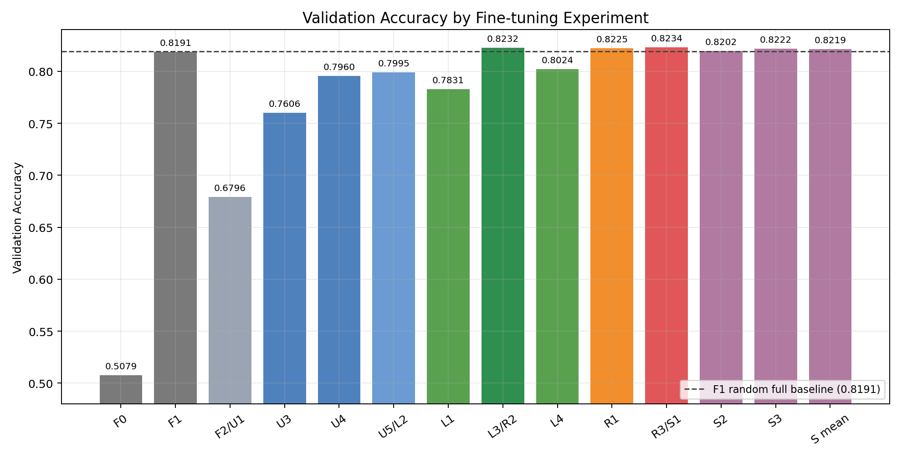
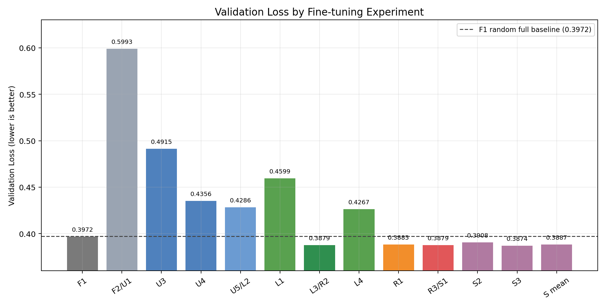
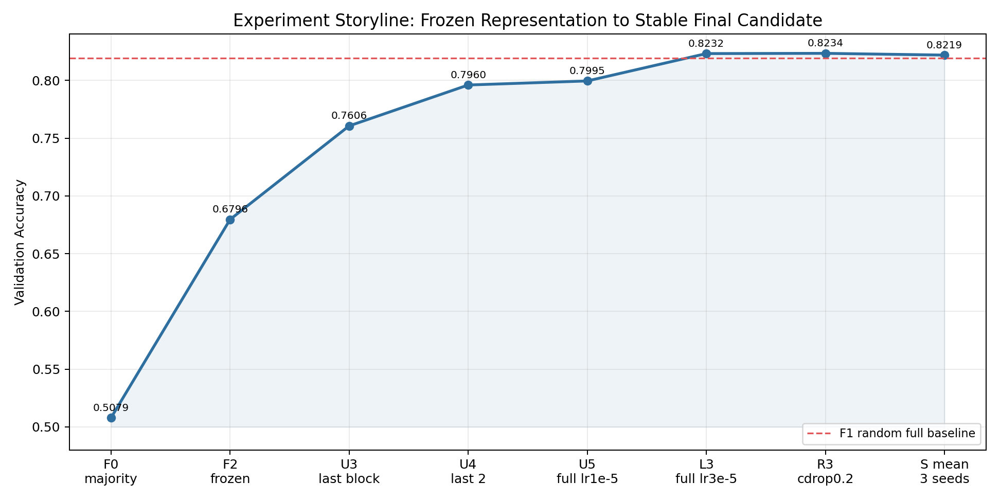
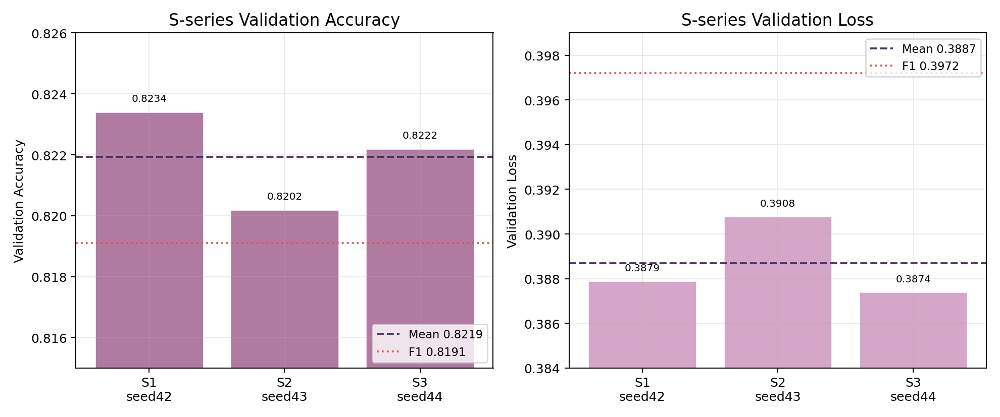

# GPT 파인튜닝 실험 종합 보고서

작성일: 2026-06-04

## 1. 실험 의의와 핵심 가설

이번 파인튜닝 실험의 핵심 질문은 단순히 “validation accuracy가 몇 점인가?”가 아니다.

더 중요한 질문은 다음이다.

> D5 사전학습 backbone을 NSMC 감성 분류 파이프라인에 계속 쓸 가치가 있는가?

여기서 **D5 사전학습 backbone**은 사전학습 D 시리즈의 `D5` 실험에서 만든 GPT 본체를 뜻한다. NSMC 문장을 감성 라벨 없이 language modeling 방식, 즉 다음 토큰 예측 방식으로 먼저 학습한 모델이다. fine-tuning 단계에서는 이 GPT 본체에 감성 분류용 classifier head를 새로 붙여서 사용했다.

구조를 나누면 다음과 같다.

| 구분 | 의미 |
| --- | --- |
| backbone | token embedding, position embedding, Transformer block들, final norm까지의 GPT 본체 |
| classifier head | backbone 출력 위에 새로 붙인 긍정/부정 분류기 |
| pretrained D5 | D5 사전학습에서 저장된 backbone 가중치로 초기화한 모델 |
| random init F1 | 같은 구조를 사전학습 가중치 없이 무작위 초기화한 모델 |

D5의 주요 설정은 다음과 같다.

| 항목 | 값 |
| --- | --- |
| 사전학습 방식 | NSMC 텍스트 next-token prediction |
| vocab size | 3000 |
| context length | 64 |
| embedding dim | 192 |
| attention heads | 4 |
| Transformer layers | 4 |
| dropout | 0.05 |
| D5 pretraining final val loss | 5.2280 |
| D5 pretraining best val loss | 약 5.2232 |

D5를 쓴 이유도 중요하다. 사전학습 모델 크기 비교에서 D6 `emb-dim=256`, `n-layers=4`가 validation loss는 아주 조금 더 낮았지만, D5와 차이가 `0.0046` 정도로 작았고 train-val gap은 D6가 훨씬 컸다. 계산량도 D6가 더 크다. 그래서 파인튜닝 실험에서는 성능, 안정성, 계산 비용을 함께 고려해 D5 `emb-dim=192`, `n-layers=4`를 현실적인 사전학습 backbone 후보로 삼았다.

이 질문이 중요한 이유는 F1 random init full fine-tuning이 이미 `0.8191` validation accuracy를 냈기 때문이다. 즉 majority baseline `0.5079`만 넘는 것으로는 충분하지 않았다. 사전학습을 계속 사용할 이유가 있으려면, random init으로 전체 모델을 학습한 강한 기준선과 비교해도 손해가 없거나 조금이라도 이득이 있어야 했다.

또 하나의 중요한 관찰은 F2 결과였다. pretrained D5를 고정하고 classifier만 학습했을 때 validation accuracy는 `0.6796`이었다. F0보다는 높았지만 F1보다는 크게 낮았다. 이 결과만 보면 “사전학습이 별로 도움이 안 되는 것 아닌가?”라고 의심할 수 있다. 그래서 이번 실험은 사전학습의 효과를 바로 결론내리는 것이 아니라, 어떤 조건에서 사전학습 backbone이 의미를 갖는지 단계별로 확인하는 방식으로 진행했다.

핵심 가설은 다음과 같다.

> D5 사전학습은 frozen 상태에서는 부족할 수 있지만, 적절히 unfreeze하고 backbone learning rate를 조정하면 random init full fine-tuning보다 validation loss와 validation accuracy를 조금이라도 안정적으로 개선할 수 있다.

이 가설은 다음 조건을 통과해야 설득력이 있다.

| 검증 조건 | 실패했을 때의 의미 | 실제 결과 |
| --- | --- | --- |
| pretrained frozen representation이 F0보다 높아야 한다 | checkpoint나 pooling, tokenizer 연결이 잘못됐거나 표현이 거의 무의미할 수 있음 | F2 `0.6796` > F0 `0.5079` |
| frozen representation만으로 F1을 넘지 못하면 unfreeze가 필요하다 | 사전학습 표현을 task에 맞게 바꾸지 않으면 부족함 | F2 `0.6796` << F1 `0.8191` |
| unfreeze 범위를 넓히면 성능이 올라야 한다 | pretrained backbone을 조정하는 방향이 유효하지 않을 수 있음 | U1 -> U3 -> U4 -> U5 순서로 개선 |
| full fine-tuning에서 lr 조정 후 F1을 넘어야 한다 | 사전학습을 쓰는 실질적 이득이 약함 | L3/R3/S가 F1을 초과 |
| seed를 바꿔도 F1보다 높아야 한다 | 단일 seed 우연일 수 있음 | S1, S2, S3 모두 F1 초과 |

따라서 이 실험의 의의는 “사전학습이 압도적으로 좋다”를 주장하는 데 있지 않다. 더 정확한 의의는 **frozen pretrained model은 부족하지만, full fine-tuning과 적절한 learning rate 조건에서는 D5 사전학습이 강한 random init 기준선보다 작고 반복 가능한 이득을 낸다는 것을 확인한 것**이다.

시리즈별 역할은 다음처럼 이어진다.

| 시리즈 | 세운 가설 | 확인한 결과 | 다음 단계로 이어진 이유 |
| --- | --- | --- | --- |
| F | 사전학습 표현 자체가 감성 분류에 도움이 되는가? | F2는 F0보다 높지만 F1보다 크게 낮음 | 표현에는 신호가 있지만 frozen만으로는 부족 |
| U | frozen이 부족하다면 어디까지 풀어야 하는가? | unfreeze 범위가 넓을수록 성능이 개선됨 | full fine-tuning이 유력하지만 lr 조정 필요 |
| L | full fine-tuning에서 backbone lr이 병목인가? | `3e-5`에서 처음으로 F1을 넘음 | 사전학습 효과가 조건부로 확인됨 |
| R | classifier dropout이 개선을 만드는가? | dropout 제거보다 약한 dropout 유지가 안정적 | 최종 후보의 regularization 범위 확정 |
| S | 최종 설정이 seed 운이 아닌가? | seed 3개 모두 F1을 넘음 | 작지만 반복 가능한 개선으로 정리 가능 |

## 2. 한 줄 결론

D5 사전학습 backbone은 **그냥 고정해서 classifier만 붙이면 부족했지만**, backbone 전체를 task에 맞게 fine-tuning하고 learning rate를 조정하자 random init 기준선을 안정적으로 조금 넘었다.

최종 후보는 다음 설정이다.

| 항목 | 최종 후보 |
| --- | --- |
| pretrained checkpoint | D5 |
| freeze mode | full |
| backbone lr | 3e-5 |
| head lr | 1e-3 |
| classifier drop rate | 0.2 |
| weight decay | 0.01 |
| max length | 64 |
| epochs | 3 |

S 시리즈 seed 3개 평균 validation accuracy는 `0.8219`이고, F1 random init full fine-tuning 기준선 `0.8191`을 모두 넘었다. 평균 validation loss도 F1의 `0.3972`에서 S 평균 `0.3887`로 낮아졌다. 개선 폭은 크지 않지만, “사전학습이 적절한 fine-tuning 조건에서 도움이 된다”는 결론은 가능하다.

## 3. 개선이 있었나?

있다. 다만 개선은 두 종류로 나누어 봐야 한다.

첫째, F2 frozen pretrained model과 비교하면 개선 폭이 매우 크다. 이는 사전학습 checkpoint를 그대로 feature extractor로 쓰는 것보다, backbone을 NSMC task에 맞게 조정하는 것이 훨씬 중요하다는 뜻이다.

둘째, F1 random init full fine-tuning과 비교하면 개선 폭은 작다. 하지만 loss와 accuracy가 모두 좋아졌고, S 시리즈 seed 3개에서 모두 F1을 넘었다. 그래서 이 결과는 “큰 성능 향상”이라기보다 “강한 기준선 위에서 작지만 반복 가능한 개선”으로 해석하는 것이 맞다.

개선 폭을 숫자로 보면 다음과 같다.

| 비교 | validation loss 변화 | validation accuracy 변화 | 해석 |
| --- | ---: | ---: | --- |
| F2 frozen -> S 평균 | `0.5993 -> 0.3887` (`-0.2106`) | `0.6796 -> 0.8219` (`+0.1423`) | backbone을 고정하지 않고 task에 맞게 조정한 효과가 큼 |
| U5/L2 -> L3 | `0.4286 -> 0.3879` (`-0.0407`) | `0.7995 -> 0.8232` (`+0.0237`) | backbone lr 조정이 가장 큰 전환점 |
| F1 random full -> S 평균 | `0.3972 -> 0.3887` (`-0.0085`) | `0.8191 -> 0.8219` (`+0.0028`) | 최종 후보가 기준선을 작지만 안정적으로 개선 |
| F1 random full -> R3/S1 | `0.3972 -> 0.3879` (`-0.0093`) | `0.8191 -> 0.8234` (`+0.0043`) | 단일 seed 기준 최고 개선폭 |

이 수치 때문에 결론을 과장해서 쓰면 안 된다. 이 실험으로 확인한 것은 “사전학습이 NSMC를 압도적으로 개선했다”가 아니다. 확인한 것은 **사전학습이 frozen 상태에서는 부족하지만, full fine-tuning과 적절한 backbone lr을 만나면 random init 기준선을 조금 넘을 수 있다**는 점이다.

이 정도 개선은 최종 제품 성능을 단정하기에는 작다. 하지만 다음 실험에서 D5 pretrained backbone을 버리지 않고 계속 후보로 둘 이유로는 충분하다.

## 4. 실험 배경과 흐름

이번 실험의 목표는 NSMC 감성 분류에서 사전학습된 GPT backbone이 실제로 도움이 되는지 확인하는 것이었다.

처음부터 최종 성능만 바로 비교하지 않고, 의심을 단계별로 줄였다.

| 시리즈 | 질문 |
| --- | --- |
| F | 사전학습 backbone을 고정한 표현만으로도 감성 분류가 되는가? |
| U | pretrained backbone을 어느 범위까지 unfreeze해야 하는가? |
| L | full fine-tuning에서 backbone learning rate는 어느 정도가 좋은가? |
| R | dropout 같은 regularization을 어떻게 둘 것인가? |
| S | 최종 후보가 seed 하나에서만 우연히 좋았던 것은 아닌가? |

실험 선택은 validation set으로만 진행했다. test set은 최종 후보가 정해진 뒤 마지막에 한 번만 평가하는 용도로 남겨둔다.

## 5. 전체 결과 요약

아래 그래프는 각 실험의 validation accuracy를 비교한 것이다. 점선은 F1 random init full fine-tuning 기준선이다.

Validation loss는 다음과 같다. 낮을수록 좋다.

실험 흐름만 따로 보면 다음처럼 정리된다.

핵심 흐름은 분명하다.

1. F2처럼 backbone을 고정하면 F1보다 크게 낮다.
2. U 시리즈에서 unfreeze 범위를 넓힐수록 성능이 올라간다.
3. U5 full fine-tuning만으로는 아직 F1을 못 넘는다.
4. L3에서 backbone lr을 `3e-5`로 올리자 처음으로 F1을 넘는다.
5. R3/S 시리즈에서 그 설정이 seed를 바꿔도 유지되는지 확인했다.

## 6. 주요 실험 결과 표

| 실험 | 목적 | final val loss | final val acc | 해석 |
| --- | --- | ---: | ---: | --- |
| F0 | majority baseline | - | 0.5079 | 데이터는 거의 균형 |
| F1 | random init full 기준선 | 0.3972 | 0.8191 | 강한 supervised 기준선 |
| F2/U1 | pretrained classifier only | 0.5993 | 0.6796 | frozen representation만으로는 부족 |
| U3 | last block unfreeze | 0.4915 | 0.7606 | classifier only보다 크게 개선 |
| U4 | last 2 blocks unfreeze | 0.4356 | 0.7960 | 더 많이 풀면 더 좋아짐 |
| U5/L2 | full fine-tuning, lr 1e-5 | 0.4286 | 0.7995 | U best지만 F1 미달 |
| L1 | full, backbone lr 5e-6 | 0.4599 | 0.7831 | 너무 보수적 |
| L3/R2 | full, backbone lr 3e-5 | 0.3879 | 0.8232 | F1 초과 |
| L4 | full, head lr 3e-4 | 0.4267 | 0.8024 | L2보다 좋지만 L3보다 낮음 |
| R1 | classifier dropout 0.0 | 0.3885 | 0.8225 | dropout 제거 이득 없음 |
| R3/S1 | classifier dropout 0.2 | 0.3879 | 0.8234 | 단일 seed 기준 최고 |
| S mean | R3 설정 seed 3개 평균 | 0.3887 | 0.8219 | 안정적으로 F1 초과 |

## 7. F 시리즈: 기준선과 frozen representation 확인

F 시리즈의 목적은 “사전학습 backbone을 고정된 feature extractor로만 써도 충분한가?”를 확인하는 것이었다.

결과는 다음과 같았다.

| 실험 | 설정 | val acc | 결론 |
| --- | --- | ---: | --- |
| F0 | majority baseline | 0.5079 | 최소 기준선 |
| F1 | random init full fine-tuning | 0.8191 | 강한 기준선 |
| F2 | pretrained D5 classifier only | 0.6796 | F0보다 높지만 F1보다 크게 낮음 |

F2는 F0보다 `+0.1718` 높다. 즉 사전학습 표현이 완전히 무의미한 것은 아니다. 하지만 F1보다 `0.1394` 낮다. 이 차이는 매우 크다.

여기서 중요한 점은 F2의 train-val gap이 작았다는 것이다. 낮은 성능이 과적합 때문이라기보다는, backbone을 고정한 상태에서 감성 분류에 필요한 표현을 충분히 바꾸지 못했기 때문으로 보는 것이 자연스럽다.

F 시리즈 결론은 다음이다.

> frozen pretrained representation만으로는 부족하다. 사전학습 효과를 보려면 backbone 일부 또는 전체를 task에 맞게 조정해야 한다.

## 8. U 시리즈: unfreeze 범위 비교

U 시리즈는 F2의 한계를 넘기 위해 backbone을 얼마나 풀어야 하는지 확인했다.

| 실험 | 학습 범위 | val loss | val acc | 해석 |
| --- | --- | ---: | ---: | --- |
| U1 | classifier only | 0.5993 | 0.6796 | F2와 동일, 한계 큼 |
| U3 | last block + final norm + classifier | 0.4915 | 0.7606 | U1보다 크게 개선 |
| U4 | last 2 blocks + final norm + classifier | 0.4356 | 0.7960 | U3보다 개선 |
| U5 | full backbone + classifier | 0.4286 | 0.7995 | U4보다 소폭 개선 |

U 시리즈의 결과는 매우 직관적이다. backbone을 더 많이 조정할수록 validation 성능이 좋아졌다.

하지만 U5도 F1 `0.8191`에는 못 미쳤다. 그래서 U 시리즈만으로는 “사전학습이 random init보다 낫다”고 말할 수 없었다.

U 시리즈 결론은 다음이다.

> D5 backbone은 고정해서 쓰는 것보다 task에 맞게 unfreeze할 때 훨씬 잘 작동한다. 다만 full fine-tuning을 해도 learning rate가 보수적이면 F1을 넘지 못한다.

## 9. L 시리즈: learning rate 비교

L 시리즈는 U5에서 남은 질문을 다뤘다.

> full fine-tuning은 맞는 방향인데, backbone learning rate가 너무 낮았던 것은 아닐까?

| 실험 | backbone lr | head lr | val loss | val acc | 해석 |
| --- | ---: | ---: | ---: | ---: | --- |
| L1 | 5e-6 | 1e-3 | 0.4599 | 0.7831 | 너무 느리고 보수적 |
| L2/U5 | 1e-5 | 1e-3 | 0.4286 | 0.7995 | U5 기준값 |
| L3 | 3e-5 | 1e-3 | 0.3879 | 0.8232 | 현재 핵심 전환점 |
| L4 | 1e-5 | 3e-4 | 0.4267 | 0.8024 | L2보다 소폭 개선 |

L1 -> L2 -> L3로 갈수록 train 성능과 validation 성능이 함께 좋아졌다. 이것은 `1e-5`가 pretrained backbone을 보존하기에는 안전했지만, NSMC 감성 분류에 맞게 표현을 바꾸기에는 부족했다는 뜻에 가깝다.

L3는 train accuracy만 높인 것이 아니다. validation loss도 `0.3879`로 낮아졌고, validation accuracy도 `0.8232`로 올라갔다. train-val gap도 매우 작았다.

L 시리즈 결론은 다음이다.

> 사전학습 backbone이 효과가 없던 것이 아니라, backbone을 충분히 빠르게 task에 맞게 조정해야 했다. L3에서 처음으로 pretrained full fine-tuning이 F1 random init full fine-tuning을 넘었다.

## 10. R 시리즈: regularization 확인

R 시리즈는 L3 설정을 기준으로 classifier dropout을 확인했다.

| 실험 | classifier drop rate | val loss | val acc | 해석 |
| --- | ---: | ---: | ---: | --- |
| R1 | 0.0 | 0.3885 | 0.8225 | dropout 제거 이득 없음 |
| R2/L3 | 0.1 | 0.3879 | 0.8232 | 안정적인 기준값 |
| R3 | 0.2 | 0.3879 | 0.8234 | accuracy 기준 임시 best |

R1은 R2보다 살짝 낮았다. 즉 classifier dropout을 완전히 끄는 것은 이득이 없었다.

R3는 validation accuracy 기준으로 R2보다 `0.0002` 높았다. 차이는 아주 작아서 강한 우위라고 말하기는 어렵지만, 적어도 dropout `0.2`가 성능을 망치지는 않았다.

R 시리즈 결론은 다음이다.

> dropout을 완전히 끄는 것보다 약한 dropout을 유지하는 것이 낫다. `0.1`과 `0.2`는 거의 동률이고, 단일 seed 기준 임시 best는 `0.2`다.

## 11. S 시리즈: seed 안정성 확인

S 시리즈는 R3 설정을 seed 42, 43, 44에서 반복했다.

| 실험 | seed | val loss | val acc | acc gap |
| --- | ---: | ---: | ---: | ---: |
| S1 | 42 | 0.3879 | 0.8234 | -0.0020 |
| S2 | 43 | 0.3908 | 0.8202 | 0.0025 |
| S3 | 44 | 0.3874 | 0.8222 | -0.0003 |
| 평균 | - | 0.3887 | 0.8219 | - |
| 표준편차 | - | 0.0018 | 0.0016 | - |

세 seed 모두 F1 `0.8191`을 넘었다. 평균 validation accuracy도 `0.8219`로 F1보다 `+0.0028` 높다.

개선 폭은 크지 않다. 하지만 S2처럼 가장 낮은 seed에서도 `0.8202`로 F1을 넘었기 때문에, R3 단일 seed가 우연히 튄 결과라고 보기는 어렵다.

S 시리즈 결론은 다음이다.

> 최종 후보는 seed가 바뀌어도 F1보다 조금 높은 성능을 유지했다. 따라서 D5 사전학습 backbone은 적절한 full fine-tuning 조건에서 안정적으로 도움이 된다.

## 12. 최종 결론

이번 파인튜닝 실험은 한 번에 답을 낸 것이 아니라, 의심을 하나씩 줄이는 방식으로 진행했다.

1. F 시리즈에서 frozen representation만으로는 부족하다는 것을 확인했다.
2. U 시리즈에서 backbone을 풀수록 성능이 좋아진다는 것을 확인했다.
3. L 시리즈에서 full fine-tuning의 learning rate를 올리자 F1 기준선을 넘었다.
4. R 시리즈에서 dropout을 완전히 끄는 것보다 약한 dropout이 낫다는 것을 확인했다.
5. S 시리즈에서 최종 후보가 seed 3개에서도 안정적으로 F1을 넘는지 확인했다.

최종적으로 말할 수 있는 것은 다음이다.

> D5 사전학습은 classifier만 붙여서는 부족하지만, full fine-tuning과 적절한 backbone learning rate를 적용하면 NSMC 감성 분류에서 random init full fine-tuning보다 안정적으로 조금 더 좋은 결과를 낸다.

다만 성능 차이는 매우 크지 않다. 평균 validation accuracy 기준 개선 폭은 `+0.0028`이다. 따라서 “압도적으로 좋다”가 아니라 “작지만 재현되는 개선이 있다”가 더 정확한 표현이다.

팀원이 이 보고서에서 가져가야 할 해석은 세 가지다.

| 질문 | 답 |
| --- | --- |
| 왜 F1 random init으로 끝내지 않았나? | F1은 강한 기준선이지만, L3/R3/S에서 pretrained full fine-tuning이 validation loss와 accuracy를 모두 조금씩 개선했기 때문이다. |
| 왜 F2가 낮았는데 사전학습을 버리지 않았나? | F2는 F0보다 높아 사전학습 표현에 신호가 있음을 보였고, U 시리즈에서 unfreeze 범위를 넓히자 성능이 계속 올라갔다. 문제는 checkpoint 자체보다 frozen 사용 방식이었다. |
| 왜 작은 개선도 의미가 있나? | 이미 F1이 높은 기준선이었고, 최종 후보는 단일 seed가 아니라 S1, S2, S3 모두에서 F1을 넘었다. 따라서 다음 실험 후보로 유지할 근거가 있다. |

아직 test set으로 최종 일반화 성능을 주장하지는 않는다. 현재 결론은 validation 기준의 모델 선택 결론이다. 최종 후보를 정한 뒤 test set은 마지막 확인 용도로만 사용한다.

## 13. 관련 문서

| 문서 | 내용 |
| --- | --- |
| `docs/fine-tuning/f-series-finetuning-report.md` | F0-F2 기준선 보고서 |
| `docs/fine-tuning/u-series-freeze-scope-report.md` | U1-U5 unfreeze 범위 보고서 |
| `docs/fine-tuning/l-series-learning-rate-report.md` | L1-L4 learning rate 보고서 |
| `docs/fine-tuning/r-series-regularization-report.md` | R1-R7 regularization 보고서 |
| `docs/fine-tuning/s-series-seed-report.md` | S1-S3 seed 반복 보고서 |
