# GPT 사전학습 실험 보고서

작성일: 2026-06-03

## 1. 요약

이 보고서는 NSMC 문장을 language modeling 방식으로 사전학습하는 작은 GPT 모델의 하이퍼파라미터 탐색 과정을 정리한다. 실험은 A부터 E까지 순차적으로 진행했다. A-D가 핵심 탐색이며, E는 D 이후 최종 후보 설정에서 `context-length`를 재확인하기 위해 추가했다.

최종적으로 현재 조건에서 가장 현실적인 사전학습 후보는 다음과 같다.

```text
learning rate = 1.5e-3
drop-rate = 0.05
emb-dim = 192
n-layers = 4
context-length = 64
```

핵심 근거는 세 가지다.

- C2는 8 epochs 장기 학습에서 가장 좋은 validation loss를 기록했다: final val loss `5.0798`, best val loss 약 `5.0440`.
- D6가 4 epochs 모델 크기 비교에서 순수 validation loss는 가장 낮았지만, D5와 차이가 매우 작고 train-val gap이 컸다. 따라서 안정성과 계산량을 고려해 D5 `192/4`를 현실적인 모델 크기로 선택했다.
- E 시리즈에서 `context-length=64`가 가장 낮은 validation loss와 가장 작은 train-val gap을 보였다.

## 2. 실험 흐름

실험은 한 번에 모든 값을 바꾸지 않고, 앞 실험의 결론을 다음 실험의 고정값으로 넘기는 방식으로 설계했다.

| 단계 | 질문 | 결론 | 다음 단계로 넘긴 값 |
| --- | --- | --- | --- |
| A | 좋은 신호를 합친 설정에서 dropout과 학습 시간이 어떤 영향을 주는가? | 8 epochs에서는 `drop-rate=0.05`가 가장 좋음 | dropout 후보 `0.05` |
| B | `5e-4`보다 더 좋은 learning rate가 있는가? | `1.5e-3`이 가장 낮은 val loss | learning rate `1.5e-3` |
| C | 높은 learning rate에서 장기 학습 시 dropout이 여전히 유효한가? | `drop-rate=0.05`가 best val/gap 균형이 가장 좋음 | `lr=1.5e-3`, `drop-rate=0.05` |
| D | 같은 최적화 설정에서 어느 모델 크기가 적절한가? | D6가 val 1위지만 D5가 현실적 best | `emb-dim=192`, `n-layers=4` |
| E | 최종 후보 모델에서 context length는 64/128/256 중 무엇이 좋은가? | `context-length=64`가 가장 안정적 | `context-length=64` |

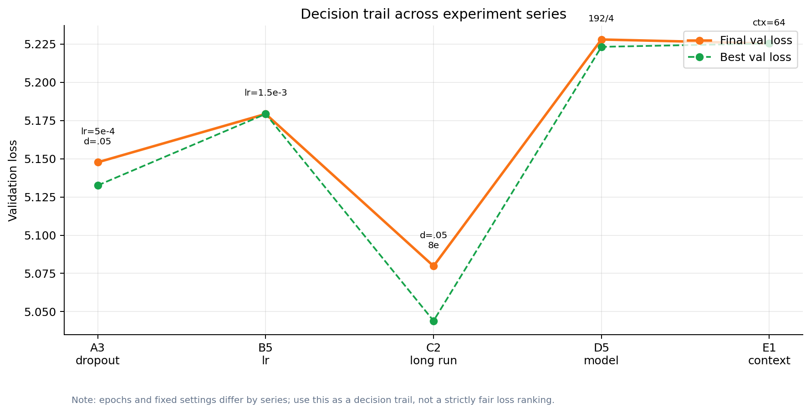

주의할 점은 D/E 시리즈는 빠른 탐색을 위해 4 epochs로 진행했고, C 시리즈는 8 epochs 장기 학습 결과라는 점이다. 따라서 서로 다른 시리즈의 loss를 단순 순위로 비교하기보다, 각 시리즈가 어떤 선택을 정당화했는지 중심으로 읽어야 한다.

### 그래프 구성

보고서에는 두 종류의 그림을 함께 둔다.

- 원본 loss curve는 각 실행에서 기록된 train/validation loss 흐름이며, 실험 결과의 1차 근거다. 각 실험별 원본 PNG는 부록에 그대로 포함했다.
- 요약 비교 그래프는 final/best validation loss와 train-val gap을 한눈에 비교하기 위해 matplotlib으로 다시 그린 2차 요약 그림이다. 결론을 설명하기 위한 그래프이며, 원본 loss curve를 대체하지 않는다.

## 3. A 시리즈: 조합 실험과 dropout 첫 확인

### 가설

기존 기준 실험에서 좋았던 신호인 `emb-dim=192`, `n-layers=4`, `lr=5e-4`를 합치면 4 epochs 기준 모델보다 validation loss가 내려갈 것으로 보았다. 또한 8 epochs로 학습을 늘리면 train loss는 더 낮아지지만, dropout 없이는 train-val gap이 커질 수 있다고 예상했다.

### 결과

| 실험 | epochs | drop-rate | final train loss | final val loss | best val loss | gap |
| --- | ---: | ---: | ---: | ---: | ---: | ---: |
| A1 | 4 | 0.0 | 4.9285 | 5.2662 | 약 5.2662 | 0.3377 |
| A2 | 8 | 0.0 | 4.1882 | 5.2562 | 약 5.2059 | 1.0680 |
| A3 | 8 | 0.05 | 4.5097 | 5.1477 | 약 5.1326 | 0.6380 |
| A4 | 8 | 0.1 | 4.6929 | 5.1590 | 약 5.1350 | 0.4661 |

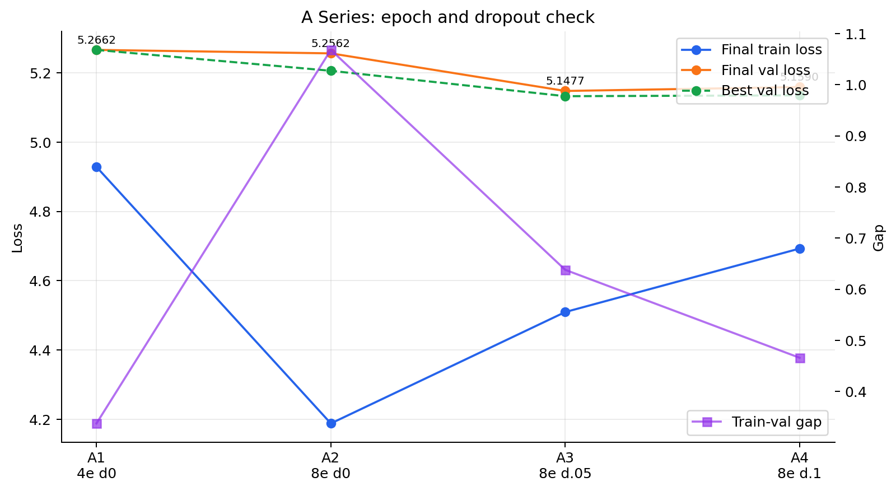

개별 train/validation loss curve 원본은 [부록 A](#a-series-loss-curves)에 포함했다.

A1은 기존 4 epochs 기준 validation loss `5.6948`보다 훨씬 낮은 `5.2662`를 기록했다. 좋은 신호를 합친 설정 자체는 성공이었다.

A2는 8 epochs까지 더 오래 학습했지만, final val loss 개선은 작았고 train-val gap이 `1.0680`까지 커졌다. 학습 데이터에는 강하게 맞춰졌지만 일반화 개선은 제한적이었다.

A3는 `drop-rate=0.05`를 적용해 final val loss `5.1477`, best val loss 약 `5.1326`을 기록했다. A2보다 train loss는 높지만 validation loss는 낮아져 약한 dropout이 일반화에 도움이 된다는 신호를 주었다.

A4는 gap은 더 작았지만 validation loss는 A3보다 약간 높았다. 따라서 A 시리즈에서는 `drop-rate=0.05`가 가장 균형이 좋았다.

### 다음 실험으로 이어진 점

A 시리즈만 보면 `lr=5e-4`, `drop-rate=0.05`, 8 epochs가 유력했다. 하지만 learning rate가 더 좋아질 여지가 남아 있었기 때문에, B 시리즈에서는 dropout을 끈 4 epochs 조건에서 learning rate를 빠르게 탐색했다.

## 4. B 시리즈: learning rate 탐색

### 가설

`5e-4`보다 큰 learning rate가 더 빠르게 좋은 지점에 도달할 수 있다고 보았다. 다만 너무 큰 learning rate는 loss를 불안정하게 만들 수 있으므로 `3e-4`부터 `1.5e-3`까지 비교했다.

### 결과

| 실험 | lr | final train loss | final val loss | best val loss | gap |
| --- | ---: | ---: | ---: | ---: | ---: |
| B1 | 3e-4 | 5.1312 | 5.3469 | 약 5.3446 | 0.2157 |
| B2 | 5e-4 | 4.9285 | 5.2662 | 약 5.2508 | 0.3377 |
| B3 | 7e-4 | 4.8473 | 5.2155 | 약 5.2085 | 0.3682 |
| B4 | 1e-3 | 4.8937 | 5.2010 | 약 5.1947 | 0.3073 |
| B5 | 1.5e-3 | 4.9818 | 5.1793 | 약 5.1793 | 0.1975 |

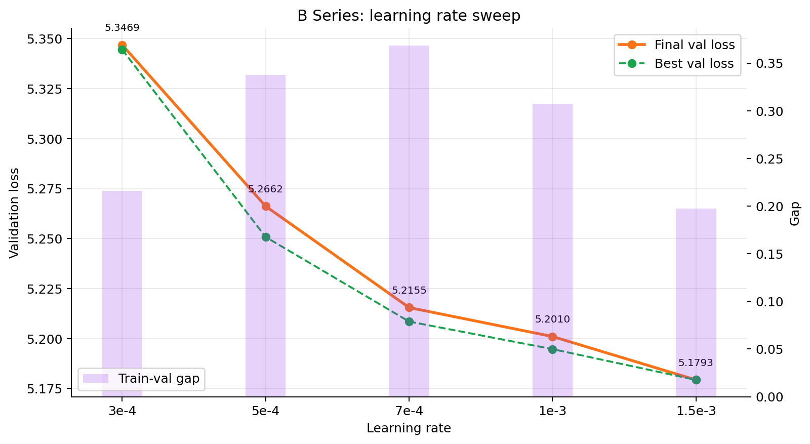

B1-B5의 train/validation loss curve 원본은 [부록 B](#b-series-loss-curves)에 포함했다.

learning rate를 키울수록 validation loss가 계속 낮아졌다. `1.5e-3`에서도 loss가 튀거나 발산하지 않았고, B5는 final val loss `5.1793`으로 B 시리즈 1위를 기록했다.

### 다음 실험으로 이어진 점

B 시리즈는 `lr=1.5e-3`이 현재 범위에서 가장 좋은 후보라는 결론을 주었다. 다만 B는 dropout을 끄고 4 epochs만 학습한 탐색이었기 때문에, C 시리즈에서는 `lr=1.5e-3`을 고정하고 8 epochs 장기 학습에서 dropout을 다시 확인했다.

## 5. C 시리즈: 높은 learning rate에서 dropout 장기 재검증

### 가설

B5의 높은 learning rate가 8 epochs에서도 유효하다면 validation loss가 더 내려갈 수 있다. 그러나 장기 학습에서는 dropout 없이 train-val gap이 커질 수 있으므로, A 시리즈에서 좋았던 `drop-rate=0.05`를 다시 확인해야 한다.

### 결과

| 실험 | drop-rate | final train loss | final val loss | best val loss | gap |
| --- | ---: | ---: | ---: | ---: | ---: |
| C1 | 0.0 | 4.4708 | 5.0812 | 약 5.0646 | 0.6104 |
| C2 | 0.05 | 4.6668 | 5.0798 | 약 5.0440 | 0.4130 |
| C3 | 0.1 | 4.8119 | 5.1151 | 약 5.0843 | 0.3032 |

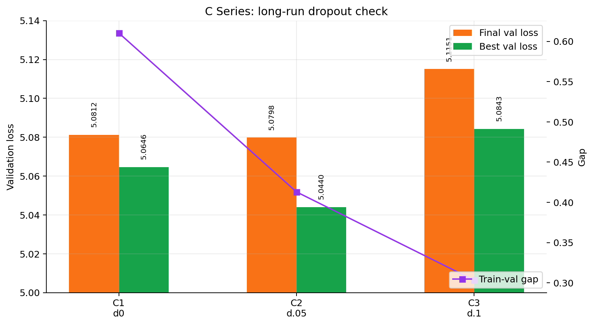

개별 train/validation loss curve 원본은 [부록 C](#c-series-loss-curves)에 포함했다.

C1은 dropout 없이도 B5보다 validation loss가 낮아져, `lr=1.5e-3`이 장기 학습에서도 유효하다는 것을 보여주었다. 그러나 gap은 `0.6104`로 컸다.

C2는 final val loss `5.0798`, best val loss 약 `5.0440`으로 C 시리즈에서 가장 좋았다. gap도 C1보다 줄어들어 성능과 일반화 균형이 가장 좋았다.

C3는 gap은 가장 작았지만 validation loss가 높아졌다. `drop-rate=0.1`은 현재 모델과 데이터에서는 규제가 너무 강한 것으로 해석했다.

### 다음 실험으로 이어진 점

C 시리즈는 최적화 설정을 `lr=1.5e-3`, `drop-rate=0.05`로 확정하는 근거가 되었다. 이후 D 시리즈에서는 이 값을 고정하고 모델 크기만 비교했다.

## 6. D 시리즈: 모델 크기 비교

### 가설

좋은 learning rate와 dropout이 정해진 뒤에는 모델 크기가 병목일 수 있다. `emb-dim`과 `n-layers`를 키우면 표현력이 좋아져 validation loss가 내려갈 수 있지만, 너무 큰 모델은 계산량과 과적합 위험을 키울 수 있다.

### 결과

| 실험 | emb-dim | n-layers | final train loss | final val loss | best val loss | gap |
| --- | ---: | ---: | ---: | ---: | ---: | ---: |
| D1 | 128 | 2 | 5.1549 | 5.3315 | 약 5.3262 | 0.1766 |
| D2 | 192 | 2 | 4.9702 | 5.2748 | 약 5.2632 | 0.3046 |
| D3 | 256 | 2 | 4.8166 | 5.2257 | 약 5.2257 | 0.4091 |
| D4 | 128 | 4 | 5.0195 | 5.3227 | 약 5.3161 | 0.3032 |
| D5 | 192 | 4 | 5.0585 | 5.2280 | 약 5.2232 | 0.1695 |
| D6 | 256 | 4 | 4.7450 | 5.2234 | 약 5.2204 | 0.4784 |

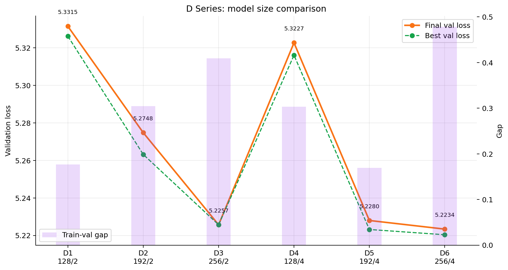

개별 train/validation loss curve 원본은 [부록 D](#d-series-loss-curves)에 포함했다.

D1/D4를 보면 `emb-dim=128`은 layer 수를 늘려도 validation loss가 높았다. 작은 embedding 차원은 표현력이 부족한 것으로 보인다.

D2/D3에서는 layer 수를 2로 고정했을 때 embedding 차원을 키울수록 validation loss가 낮아졌다. 표현 크기 확대는 분명히 도움이 되었다.

D5와 D6가 핵심 비교였다. D6는 final val loss `5.2234`로 순수 validation loss 1위였지만, D5의 `5.2280`과 차이는 `0.0046`에 불과했다. 반면 D6의 gap은 `0.4784`로 D5의 `0.1695`보다 훨씬 컸다.

### 결론

순수 성능만 보면 D6 `256/4`가 가장 좋다. 하지만 개선폭이 작고 gap이 크며 계산량도 늘어난다. 따라서 이후 실험의 현실적인 모델 크기는 D5 `emb-dim=192`, `n-layers=4`로 두는 것이 더 합리적이다.

## 7. E 시리즈: context length 재검증

### 가설

기존 실험에서는 `context-length=64`가 좋아 보였지만, 128이나 256은 step 수가 줄어 충분히 학습되지 못했을 수 있다. D5 모델 크기와 C2 최적화 설정을 고정한 뒤 context length만 다시 비교했다.

### 결과

| 실험 | context length | final train loss | final val loss | best val loss | gap |
| --- | ---: | ---: | ---: | ---: | ---: |
| E1 | 64 | 5.0741 | 5.2254 | 약 5.2254 | 0.1513 |
| E2 | 128 | 4.8942 | 5.3675 | 약 5.3675 | 0.4733 |
| E3 | 256 | 4.8999 | 5.4494 | 약 5.4494 | 0.5495 |

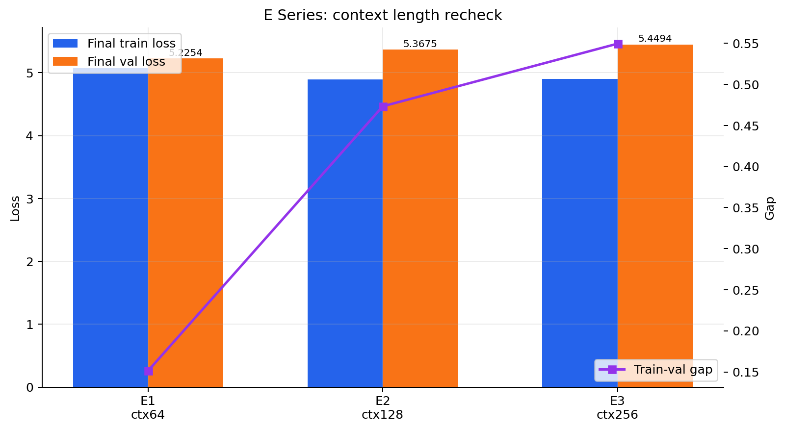

개별 train/validation loss curve 원본은 [부록 E](#e-series-loss-curves)에 포함했다.

E1은 D5와 거의 같은 조건의 재현 실험에 가깝고, validation loss도 `5.2254`로 안정적으로 나왔다.

E2/E3는 train loss가 낮아졌지만 validation loss는 크게 높아졌다. 특히 `context-length=256`은 val loss `5.4494`, gap `0.5495`로 가장 나빴다.

### 결론

현재 코드와 4 epochs 조건에서는 `context-length=64`가 가장 효율적이고 안정적이다. 긴 context가 본질적으로 나쁘다는 결론은 아니다. context length별 final step이 달라질 수 있으므로, 더 엄밀히 비교하려면 `--max-steps`를 추가해 같은 update 수로 재실험해야 한다.

## 8. 최종 후보 설정

현재 실험 흐름에서 선택할 사전학습 후보는 다음과 같다.

| 항목 | 선택값 | 근거 |
| --- | --- | --- |
| learning rate | `1.5e-3` | B5가 B 시리즈 최저 validation loss |
| drop-rate | `0.05` | A3/C2에서 장기 학습 일반화 균형이 가장 좋음 |
| emb-dim | `192` | D5가 D6와 거의 동률이면서 gap과 계산량이 더 현실적 |
| n-layers | `4` | D5가 `192/2`보다 좋고 기존 A-C 흐름과도 일관됨 |
| context-length | `64` | E1이 E 시리즈 최저 validation loss와 최저 gap |

```text
--lr 1.5e-3
--drop-rate 0.05
--emb-dim 192
--n-layers 4
--context-length 64
```

## 9. 한계와 주의점

- D/E 시리즈는 빠른 탐색을 위해 4 epochs로 진행했기 때문에, C 시리즈 8 epochs 결과와 직접 loss 순위를 비교하면 안 된다.
- E2/E3는 final step이 제공되지 않았다. context length가 커지면 epoch당 update 수가 달라질 수 있으므로 해석에 주의해야 한다.
- D6는 validation loss가 가장 낮았지만 D5와 차이가 매우 작다. 계산 여유가 충분하다면 D6도 최종 장기 재검증 후보로 남겨둘 수 있다.
- context length 결론을 엄밀하게 내리려면 `--max-steps` 옵션을 추가해 같은 update 수로 비교하는 것이 좋다.

## 10. 다음 단계

보고서 기준의 다음 선택지는 두 가지다.

1. 최종 후보 설정을 8 epochs 이상으로 다시 학습해 C2와 비슷하게 재현되는지 확인한다.
2. 현재 A-E 실험 흐름을 최종 보고서로 제출하되, D/E는 빠른 탐색 결과이고 C2가 장기 학습 핵심 근거라는 점을 명시한다.

최종 후보 설정이 장기 재검증에서도 C2 수준으로 유지된다면, 이 설정을 현재 프로젝트의 사전학습 best로 둘 수 있다.

## 부록: 원본 학습 곡선

아래 그림은 각 실험 실행에서 나온 원본 train/validation loss curve다. 본문의 요약 비교 그래프는 이 원본 곡선을 바탕으로 시리즈별 결론을 빠르게 비교하기 위한 보조 자료로만 사용한다.

### A Series Loss Curves

| A1 | A2 |
| --- | --- |
| 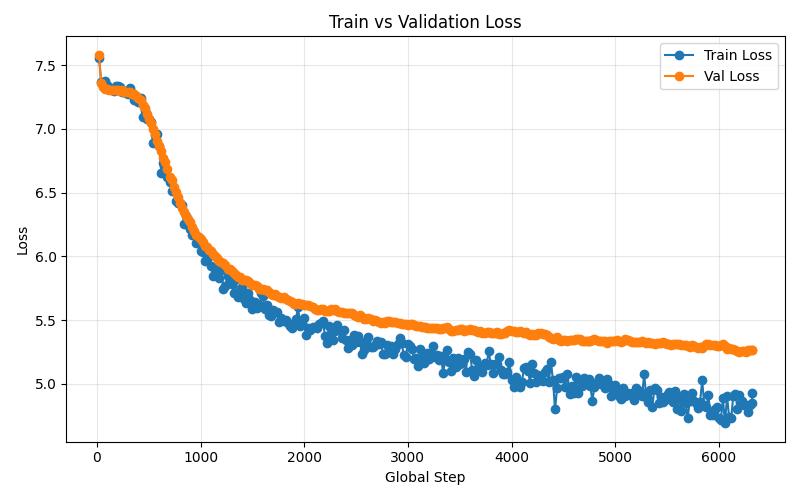 | 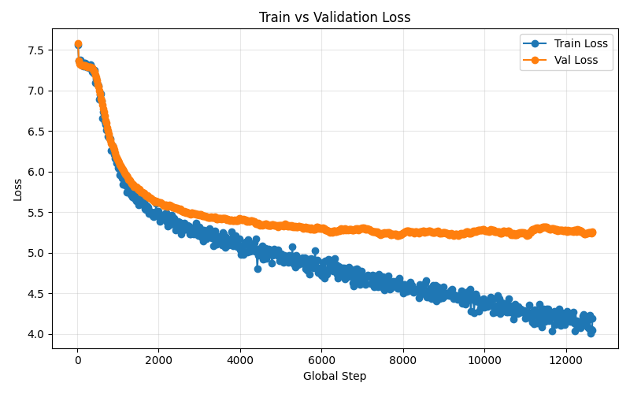 |
| A3 | A4 |
| 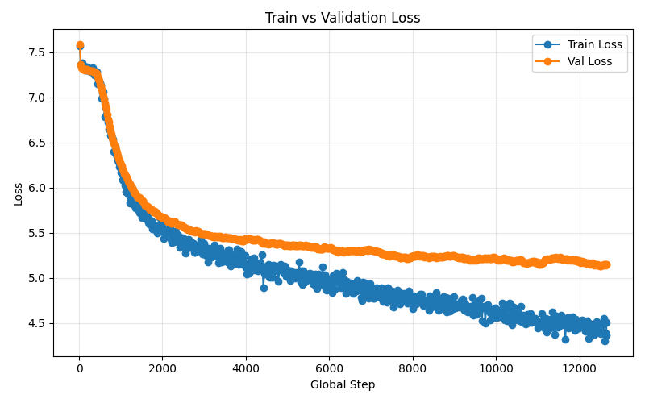 | 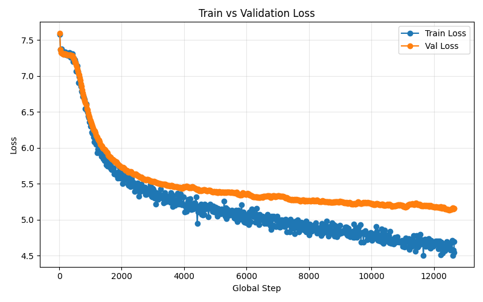 |

### B Series Loss Curves

| B1 | B2 | B3 |
| --- | --- | --- |
| 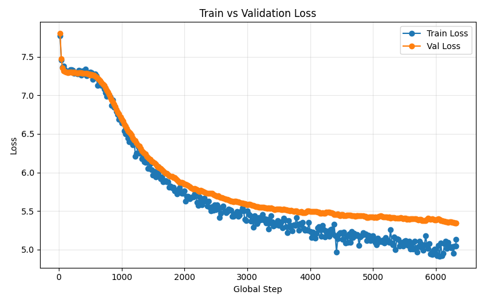 |  | 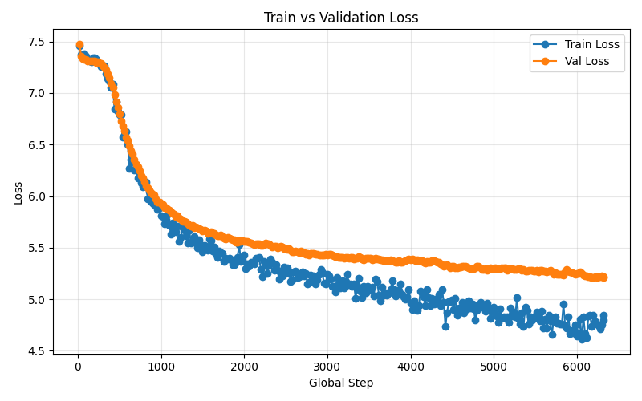 |
| B4 | B5 |  |
| 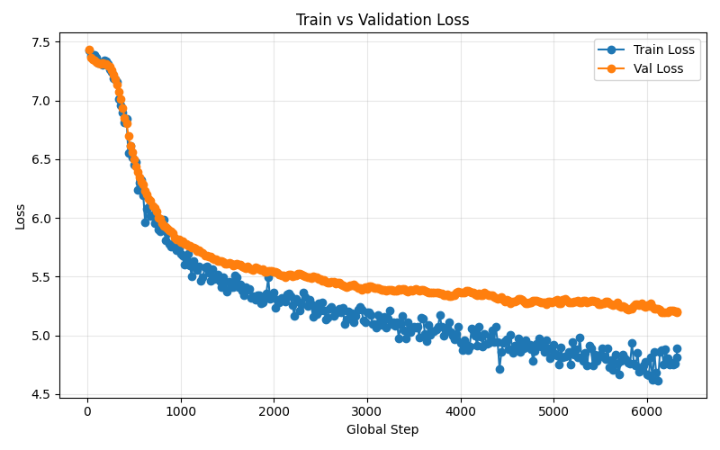 | 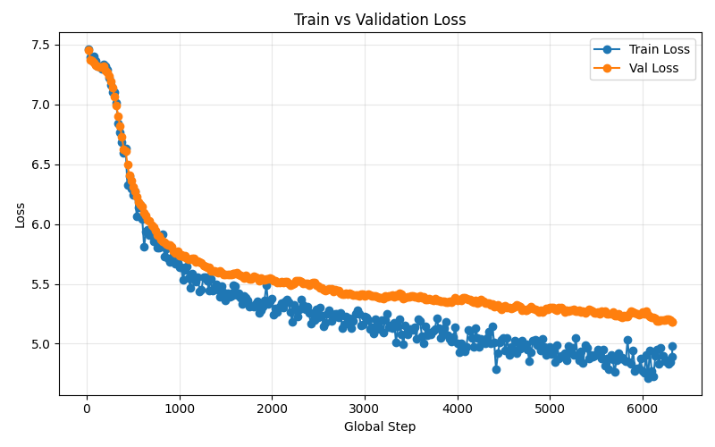 |  |

### C Series Loss Curves

| C1 | C2 | C3 |
| --- | --- | --- |
| 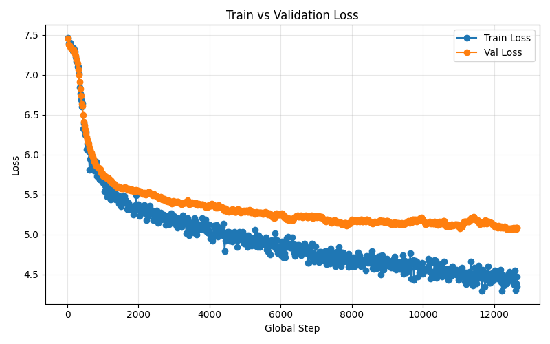 | 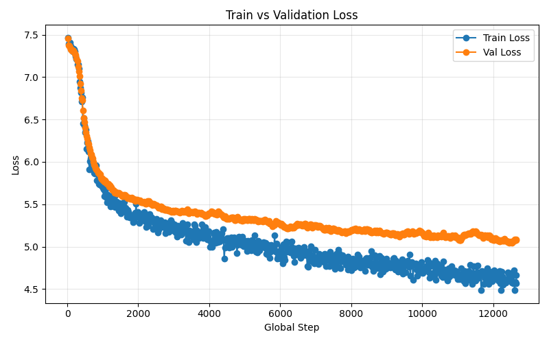 | 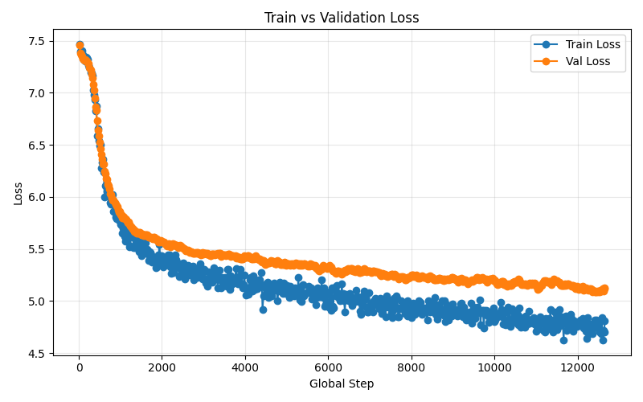 |

### D Series Loss Curves

| D1 | D2 |
| --- | --- |
| 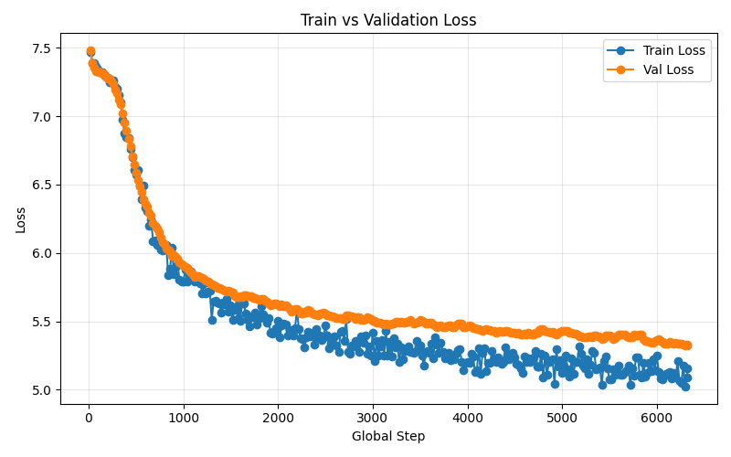 | 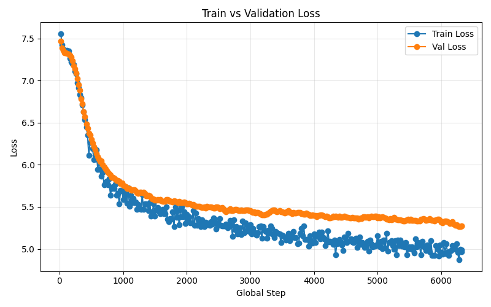 |
| D3 | D4 |
| 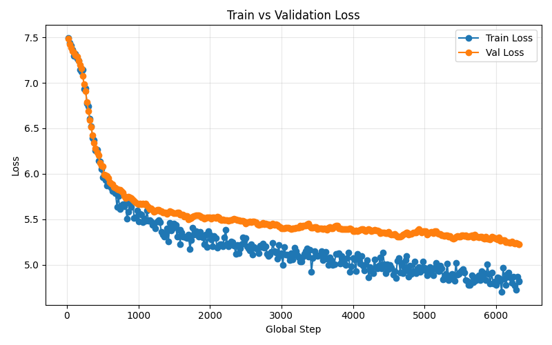 | 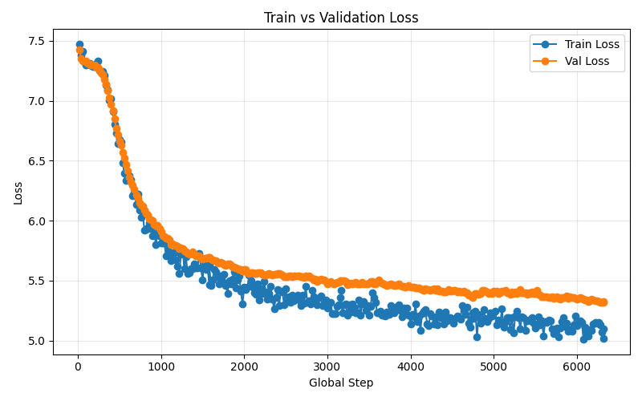 |
| D5 | D6 |
| 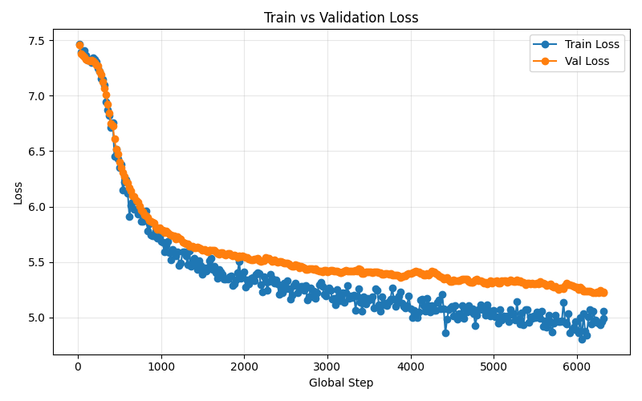 | 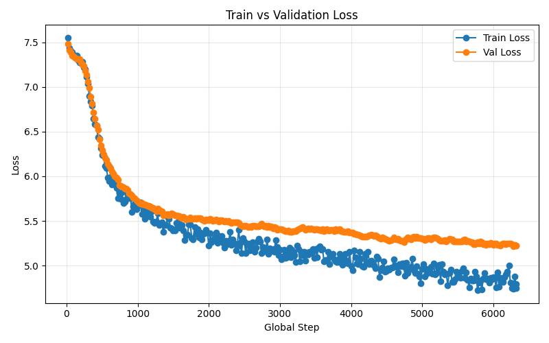 |

### E Series Loss Curves

| E1 | E2 | E3 |
| --- | --- | --- |
| 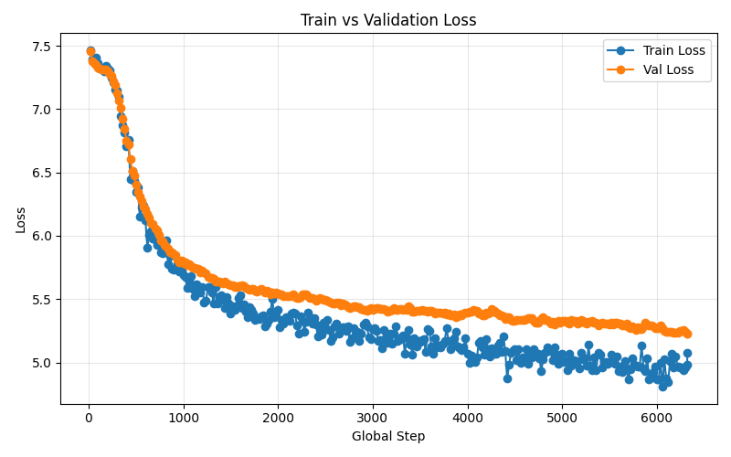 | 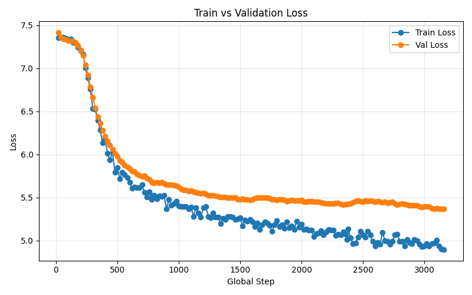 | 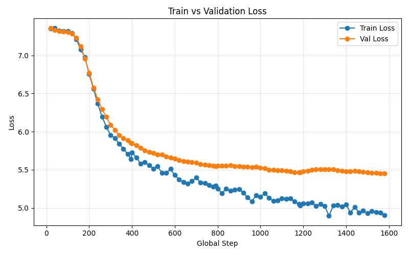 |
